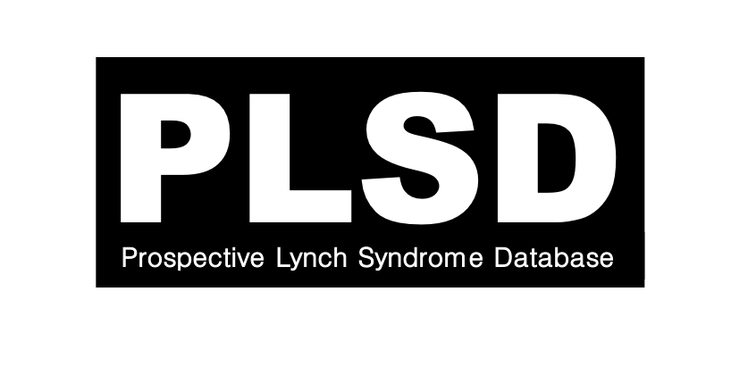

## lscarisk.org 

* an interactive web application for assessment of individualized cancer risk in Lynch syndrome carriers
* the application has been developed in [Shiny - a web application framework for R](https://shiny.rstudio.com)

Website can be accessed here: http://lscarisk.org
